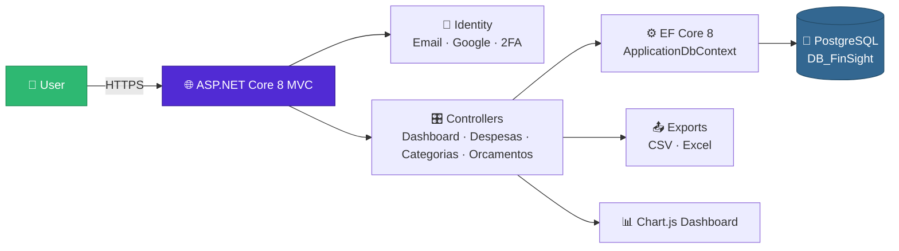

<div align="center">


<a href="https://github.com/MacieiraPT/finsight">
  
</a>

<br/>

<p>
  
  
  
  
  
</p>

<p>
  
  
  
  
  
  
</p>

</div>

---

## 🌟 About the Project

> **FinSight** is a personal finance management web application that helps you **track expenses**, **manage monthly budgets**, and **visualise spending trends** through an elegant, accessible Portuguese (pt-PT) interface.
>
> Built as part of *UFCD 5425 – Bases de Dados*, FinSight pairs a clean ASP.NET Core 8 MVC architecture with a PostgreSQL backend, secure ASP.NET Core Identity authentication (Email · Google · 2FA), and a responsive Bootstrap 5 dashboard powered by Chart.js.

<div align="center">

| 🎯 Goal | 🔐 Privacy | 📈 Insight |
|:---:|:---:|:---:|
| Help users take control of personal spending | Strict per-user data isolation everywhere | Charts, budgets, and alerts that act before you overspend |

</div>

---

## ✨ Features

<table>
  <tr>
    <td width="50%" valign="top">

### 💸 Expense Tracking
- Filterable, sortable, paginated lists
- Search by note · category · year · month
- Date validation: no future entries
- Per-user isolation enforced at every query

### 🗂️ Smart Categories
- Unique category names per user
- Restrict-delete protection (no orphaned data)
- One-click seed of 10 default PT categories

    </td>
    <td width="50%" valign="top">

### 🎯 Monthly Budgets
- Set spending limits per category, per month
- Real-time progress bars on the dashboard
- Automatic alerts when you approach the limit

### 📊 Insightful Dashboard
- Monthly totals at a glance
- Distribution by category
- 6-month spending evolution
- Salary-based personalised alerts

    </td>
  </tr>
  <tr>
    <td width="50%" valign="top">

### 🔐 Secure Authentication
- ASP.NET Core Identity (email + password)
- Google OAuth single-sign-on
- TOTP two-factor authentication (QR code)
- Per-user financial settings page

    </td>
    <td width="50%" valign="top">

### 📤 Data Export
- Export filtered expenses to **CSV**
- Export filtered expenses to **Excel (.xlsx)**
- Both honour the same active filters
- Powered by ClosedXML

    </td>
  </tr>
</table>

---

## 🧰 Tech Stack

<div align="center">

### Backend


### Database


### Frontend


### Tooling & Libraries


</div>

---

## 🏗️ Architecture



### 📁 Repository Layout

```
FinSight/
├── backend/GestaoDespesas/
│   └── GestaoDespesas/
│       ├── Controllers/        # MVC controllers
│       ├── Data/               # ApplicationDbContext + SeedTestData
│       ├── Migrations/         # EF Core migrations
│       ├── Models/             # Domain: Despesa, Categoria, Orcamento, UserProfile
│       ├── Views/              # Razor views (.cshtml)
│       ├── Areas/Identity/     # Auth Razor Pages (Login, 2FA, Settings)
│       └── Program.cs          # App entry point & DI
├── database/
│   ├── init.sql                # Reference schema
│   └── create_db.sql           # DB + user creation
├── instalar.bat · iniciar.bat · parar.bat
└── README.md
```

---

## 🧱 Domain Model

<div align="center">

| Model | Table | Purpose |
|:---|:---|:---|
| 💸 `Despesa` | `Despesas` | Expense (value, date, category, notes, user) |
| 🗂️ `Categoria` | `Categorias` | Category — **unique per user** |
| 🎯 `Orcamento` | `Orcamentos` | Monthly budget limit per category |
| 👤 `UserProfile` | `UserProfiles` | Salary, limit %, alert toggle |

</div>

> **Key relationships**
> `Categoria` → `Despesa` (one-to-many, **restrict delete**) · `Categoria` → `Orcamento` (one-to-many) · `IdentityUser` → `UserProfile` (one-to-one)

---

## 🚦 Routes Overview

<details>
  <summary><b>📊 DashboardController</b></summary>

| Action | Route | Notes |
|:---|:---|:---|
| `Index` | `GET /Dashboard` | Monthly totals · charts · budget progress · alerts |

</details>

<details>
  <summary><b>💸 DespesasController (Expenses)</b></summary>

| Action | Route | Notes |
|:---|:---|:---|
| `Index` | `GET /Despesas` | Filterable · sortable · paginated (10/page) |
| `Create` | `GET/POST /Despesas/Create` | No future dates allowed |
| `Edit` | `GET/POST /Despesas/Edit/{id}` | |
| `Delete` | `GET/POST /Despesas/Delete/{id}` | |
| `Details` | `GET /Despesas/Details/{id}` | |
| `ExportarCsv` | `POST /Despesas/ExportarCsv` | Honours active filters |
| `ExportarExcel` | `POST /Despesas/ExportarExcel` | ClosedXML, honours filters |

</details>

<details>
  <summary><b>🗂️ CategoriasController (Categories)</b></summary>

| Action | Route | Notes |
|:---|:---|:---|
| `Index` | `GET /Categorias` | |
| `Create` | `GET/POST /Categorias/Create` | Unique name per user |
| `Edit` | `GET/POST /Categorias/Edit/{id}` | |
| `Delete` | `GET/POST /Categorias/Delete/{id}` | Blocked if expenses exist |
| `Details` | `GET /Categorias/Details/{id}` | |
| `SeedDefault` | `POST /Categorias/SeedDefault` | Adds 10 default PT categories |

</details>

<details>
  <summary><b>🎯 OrcamentosController (Budgets)</b></summary>

| Action | Route | Notes |
|:---|:---|:---|
| `Index` | `GET /Orcamentos` | |
| `Create` | `GET/POST /Orcamentos/Create` | |
| `Edit` | `GET/POST /Orcamentos/Edit/{id}` | |
| `Delete` | `GET/POST /Orcamentos/Delete/{id}` | |
| `Details` | `GET /Orcamentos/Details/{id}` | |

</details>

<details>
  <summary><b>🔐 Identity (Razor Pages)</b></summary>

- `Account/Login` · `Account/Logout` · `Account/Register`
- `Account/ExternalLogin` (Google OAuth)
- `Account/LoginWith2fa` · `Account/Manage/EnableAuthenticator`
- `Account/Manage/TwoFactorAuthentication`
- `Account/Manage/FinancialSettings` *(custom)*

</details>

---

## 🚀 Getting Started

### ⚙️ Requirements

- [.NET 8 SDK](https://dotnet.microsoft.com/en-us/download/dotnet/8.0)
- [PostgreSQL 14+](https://www.postgresql.org/download/)

### 🪟 Windows — One-click scripts

```bat
:: 1️⃣ Install deps, create DB, apply migrations
instalar.bat

:: 2️⃣ Start the app  →  https://localhost:7093
iniciar.bat

:: 3️⃣ Stop the app
parar.bat
```

### 🐧 Cross-platform (manual)

```bash
# Restore the dotnet-ef tool
dotnet tool restore

# Create the PostgreSQL user & database
psql -U postgres -c "CREATE USER finsight WITH PASSWORD 'finsight123';"
psql -U postgres -c "CREATE DATABASE \"DB_FinSight\" OWNER finsight;"

# Apply migrations
cd backend/GestaoDespesas
dotnet ef database update --project GestaoDespesas

# Run
dotnet run --project GestaoDespesas
```

<div align="center">

| Endpoint | URL |
|:---:|:---:|
| 🔒 HTTPS | `https://localhost:7093` |
| 🌐 HTTP | `http://localhost:5067` |

</div>

---

## ⚙️ Configuration

The app reads from `appsettings.json` (git-ignored). Copy the example template:

```bash
cp appsettings.Example.json appsettings.json
```

```json
{
  "ConnectionStrings": {
    "DefaultConnection": "Host=localhost;Port=5432;Database=DB_FinSight;Username=finsight;Password=finsight123"
  },
  "SeedAdmin": {
    "Email": "test@finsight.pt",
    "Password": "Test123!"
  },
  "Auth": {
    "Google": {
      "ClientId": "<google-client-id>",
      "ClientSecret": "<google-client-secret>"
    }
  }
}
```

> ⚠️ **Never commit** `appsettings.json` or `appsettings.Development.json` — both are in `.gitignore`.

---

## 🧪 Test Account

After first run, a seeded test user is automatically available with realistic sample data (5 categories, 5 budgets, 40 expenses):

<div align="center">

| 📧 Email | 🔑 Password |
|:---:|:---:|
| `test@finsight.pt` | `Test123!` |

</div>

---

## 🧬 Database Migrations

```bash
# Working directory: backend/GestaoDespesas/

# New migration
dotnet ef migrations add <MigrationName> --project GestaoDespesas

# Apply pending
dotnet ef database update --project GestaoDespesas

# Revert
dotnet ef database update <PreviousMigrationName> --project GestaoDespesas
```

---

## 🛡️ Conventions & Best Practices

| Convention | Rule |
|:---|:---|
| 🔒 **User isolation** | Every query filters by `UserId` from `ClaimTypes.NameIdentifier` |
| 🌍 **UTC dates** | All `DateTime` columns are converted to UTC by `ApplicationDbContext` |
| 🇵🇹 **Language** | UI, validation, and field names are in Portuguese (pt-PT) |
| 🚫 **Restrict delete** | Categories with expenses cannot be deleted |
| 📄 **Pagination** | List views default to 10 items per page |
| 📤 **Exports** | CSV & Excel honour the same filters as list views |

---

## 📦 Key NuGet Packages

| Package | Version | Purpose |
|:---|:---:|:---|
| `Microsoft.AspNetCore.Identity.EntityFrameworkCore` | 8.0.24 | Identity + EF |
| `Microsoft.AspNetCore.Identity.UI` | 8.0.24 | Scaffolded Razor Pages |
| `Microsoft.AspNetCore.Authentication.Google` | 8.0.24 | Google OAuth |
| `Npgsql.EntityFrameworkCore.PostgreSQL` | 8.0.11 | PostgreSQL EF provider |
| `Microsoft.EntityFrameworkCore.Tools` | 8.0.24 | `dotnet ef` CLI |
| `ClosedXML` | 0.105.0 | Excel `.xlsx` export |
| `QRCoder` | 1.7.0 | 2FA QR code generation |

---

## 📈 Repository Stats

<div align="center">


<br/><br/>


</div>

---

## 🤝 Contributing

Contributions, issues, and feature requests are welcome! Feel free to open an [issue](https://github.com/MacieiraPT/finsight/issues) or submit a pull request.

1. 🍴 Fork the project
2. 🌿 Create your feature branch (`git checkout -b feature/amazing-feature`)
3. 💾 Commit your changes (`git commit -m 'feat: add amazing feature'`)
4. 📤 Push to the branch (`git push origin feature/amazing-feature`)
5. 🔀 Open a Pull Request

---

## 📄 License

Distributed under the **MIT License**. See [`LICENSE.txt`](./LICENSE.txt) for details.

<div align="center">


<br/><br/>


<sub>⭐ If you find FinSight useful, consider starring the repo — it really helps!</sub>

</div>
